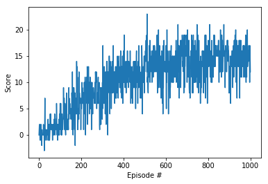
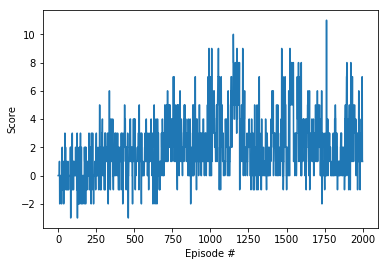
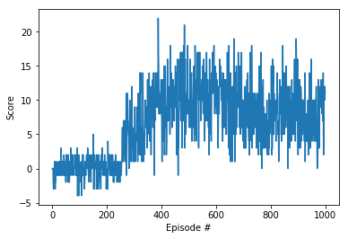

# Project 1: Navigation
### Introduction
For this project, you will train an agent to navigate (and collect bananas!) in a large, square world.

A reward of +1 is provided for collecting a yellow banana, and a reward of -1 is provided for collecting a blue banana. Thus, the goal of your agent is to collect as many yellow bananas as possible while avoiding blue bananas.

The state space has 37 dimensions and contains the agent's velocity, along with ray-based perception of objects around agent's forward direction. Given this information, the agent has to learn how to best select actions. Four discrete actions are available, corresponding to:
- **`0`** - move forward.
- **`1`** - move backward.
- **`2`** - turn left.
- **`3`** - turn right.

### Getting Started

1. Download the environment from one of the links below.  You need only select the environment that matches your operating system:
    - Linux: [click here](https://s3-us-west-1.amazonaws.com/udacity-drlnd/P1/Banana/Banana_Linux.zip)
    - Mac OSX: [click here](https://s3-us-west-1.amazonaws.com/udacity-drlnd/P1/Banana/Banana.app.zip)
    - Windows (32-bit): [click here](https://s3-us-west-1.amazonaws.com/udacity-drlnd/P1/Banana/Banana_Windows_x86.zip)
    - Windows (64-bit): [click here](https://s3-us-west-1.amazonaws.com/udacity-drlnd/P1/Banana/Banana_Windows_x86_64.zip)
    
    (_For Windows users_) Check out [this link](https://support.microsoft.com/en-us/help/827218/how-to-determine-whether-a-computer-is-running-a-32-bit-version-or-64) if you need help with determining if your computer is running a 32-bit version or 64-bit version of the Windows operating system.

    (_For AWS_) If you'd like to train the agent on AWS (and have not [enabled a virtual screen](https://github.com/Unity-Technologies/ml-agents/blob/master/docs/Training-on-Amazon-Web-Service.md)), then please use [this link](https://s3-us-west-1.amazonaws.com/udacity-drlnd/P1/Banana/Banana_Linux_NoVis.zip) to obtain the environment.

2. Place the file in this folder, unzip (or decompress) the file and then write the correct path in the argument for creating the environment under the notebook `Navigation_solution.ipynb`:
```python
env = env = UnityEnvironment(file_name="Banana.app")
```
### Description
```
.
├── images                      #  Supporting images
├── checkpoint                  #  Contains the saved models
│   ├──  duel_dqn.pth            # Saved model weights for the Dueling Double DQN model
│   ├──  double_dqn.pth          # Saved model weights for the Double DQN model
│   ├──  prioritize_dqn.pth      # Saved model weights for the Prioritize DQN model
├── results                    # Contains images of result
│   ├── duel_dqn_result.png     # Result for the Dueling Double DQN model
│   ├── double_dqn_result.png   # Result for the Double DQN model
│   ├── prioritize_dqn_result.png     # Result for the Prioritize DQN model
├── Dueling_DQN_Navigation.ipynb      # Notebook with solution using Dueling Double DQN model
├── Double_DQN_Navigation.ipynb        # Notebook with solution using Double DQN model
├── Prioritized_DQN_Navigation.ipynb   # Notebook with solution using Prioritized DQN model
├── Navigation.ipynb   # Explore the unity environment

```

### Instructions

Follow the instructions in `Navigation.ipynb` to get started with training your own agent! 
To watch a trained smart agent, Every notebook will have the section `Model in action` run that section after loading the `enviroment`. It will load the save model and start playing the game.

### Paper implemented
- Double DQN [[Paper](https://arxiv.org/abs/1509.06461)] [[Code](./Double_DQN_Navigation.ipynb)]
- Prioritized Experience Replay [[Paper](https://arxiv.org/abs/1511.05952)] [[Code](./Prioritized_DQN_Navigation.ipynb )]
- Dueling DQN [[Paper](https://arxiv.org/abs/1511.06581)] [[Code](./Dueling_DQN_Navigation.ipynb)]

### Results
Plot showing the score per episode over all the episodes. The environment was solved in **1000** episodes.
| Double DQN | Prioritize DQN | Dueling DQN |
:-------------------------:|:-------------------------:|:-------------------------:
 |   |  

