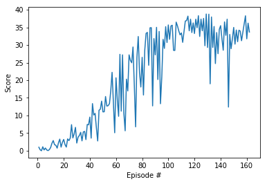

# Project 2: Reacher Continuous Control
### Project description

In this environment called Reacher, a double-jointed arm can move to target locations. A reward of +0.1 is provided for each step that the agent's hand is in the goal location. Thus, the goal the agent is to maintain its position at the target location for as many time steps as possible. Additional information can be found here: [link](https://github.com/Unity-Technologies/ml-agents/blob/master/docs/Learning-Environment-Examples.md#reacher)

The observation space consists of  Each action is a vector with four numbers, 

- **State space** is `33` dimensional continuous vector, consisting of position, rotation, velocity, and angular velocities of the arm.

- **Action space** is `4` dimentional continuous vector, corresponding to torque applicable to two joints. Every entry in the action vector should be a number between -1 and 1.

- **Solution criteria**: the environment is considered as solved when the agent gets an average score of **+30 over 100 consecutive episodes** (averaged over all agents in case of multiagent environment).

## Dependencies

To set up your python environment to run the code in this repository, please follow the instructions below.

1. Create (and activate) a new environment with Python 3.6.

	- __Linux__ or __Mac__: 
	```bash
	conda create --name drlnd python=3.6
	source activate drlnd
	```
	- __Windows__: 
	```bash
	conda create --name drlnd python=3.6 
	activate drlnd
	```
	
2. Follow the instructions in [this repository](https://github.com/openai/gym) to perform a minimal install of OpenAI gym.  
	- Next, install the **classic control** environment group by following the instructions [here](https://github.com/openai/gym#classic-control).
	- Then, install the **box2d** environment group by following the instructions [here](https://github.com/openai/gym#box2d).
	
3. Clone the repository (if you haven't already!), and navigate to the `python/` folder.  Then, install several dependencies.
```bash
git clone https://github.com/udacity/deep-reinforcement-learning.git
cd deep-reinforcement-learning/python
pip install .
```

4. Create an [IPython kernel](http://ipython.readthedocs.io/en/stable/install/kernel_install.html) for the `drlnd` environment.  
```bash
python -m ipykernel install --user --name drlnd --display-name "drlnd"
```

5. Before running code in a notebook, change the kernel to match the `drlnd` environment by using the drop-down `Kernel` menu. 


## Getting Started

1. Download the environment from one of the links below.  You need only select the environment that matches your operating system (Note: Releteted with second option of environemt):

    - **_Twenty (20) Agents_**
        - Linux: [click here](https://s3-us-west-1.amazonaws.com/udacity-drlnd/P2/Reacher/Reacher_Linux.zip)
        - Mac OSX: [click here](https://s3-us-west-1.amazonaws.com/udacity-drlnd/P2/Reacher/Reacher.app.zip)
        - Windows (32-bit): [click here](https://s3-us-west-1.amazonaws.com/udacity-drlnd/P2/Reacher/Reacher_Windows_x86.zip)
        - Windows (64-bit): [click here](https://s3-us-west-1.amazonaws.com/udacity-drlnd/P2/Reacher/Reacher_Windows_x86_64.zip)
    
    (_For Windows users_) Check out [this link](https://support.microsoft.com/en-us/help/827218/how-to-determine-whether-a-computer-is-running-a-32-bit-version-or-64) if you need help with determining if your computer is running a 32-bit version or 64-bit version of the Windows operating system.

    (_For AWS_) If you'd like to train the agent on AWS (and have not [enabled a virtual screen](https://github.com/Unity-Technologies/ml-agents/blob/master/docs/Training-on-Amazon-Web-Service.md)), then please use [this link](https://s3-us-west-1.amazonaws.com/udacity-drlnd/P2/Reacher/one_agent/Reacher_Linux_NoVis.zip) (version 1) or [this link](https://s3-us-west-1.amazonaws.com/udacity-drlnd/P2/Reacher/Reacher_Linux_NoVis.zip) (version 2) to obtain the "headless" version of the environment.  You will **not** be able to watch the agent without enabling a virtual screen, but you will be able to train the agent.  (_To watch the agent, you should follow the instructions to [enable a virtual screen](https://github.com/Unity-Technologies/ml-agents/blob/master/docs/Training-on-Amazon-Web-Service.md), and then download the environment for the **Linux** operating system above._)

2. Place the file in this folder, unzip (or decompress) the file and then write the correct path in the argument for creating the environment under the notebook `Continuous_Control_DDPG.ipynb`:
```python
env = env = UnityEnvironment(file_name="Reacher.app")
```
### Description
```
.
├── images                      #  Supporting images
├── checkpoint                  #  Contains the saved models
│   ├──  checkpoint_actor.pth            # Saved model weights for Actor network
│   ├──  checkpoint_critic.pth           # Saved model weights for Critic Network
├── results                    # Contains images of result
│   ├── ddpg_result.png         # Plot Result for the DDPGmodel
├── Continuous_Control_DDPG.ipynb      # Notebook with solution using DDPG model
```

### Instructions

Follow the instructions in `Continuous_Control_DDPG.ipynb` to get started with training your own agent! 
To watch a trained smart agent, Every notebook will have the section `Model in action` run that section after loading the `enviroment`. It will load the save model and start playing the game.

### Paper implemented
- Deep Deterministic Policy Gradients (DDPG) [[Paper](https://arxiv.org/abs/1509.02971)] [[Code](./Continuous_Control_DDPG.ipynb)]

### Results
Plot showing the score per episode over all the episodes. The environment was solved in **162** episodes.

